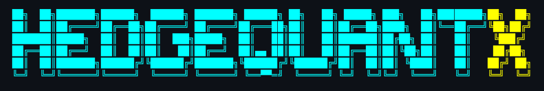
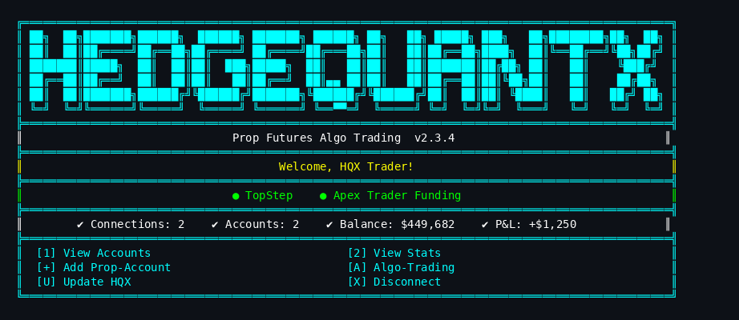
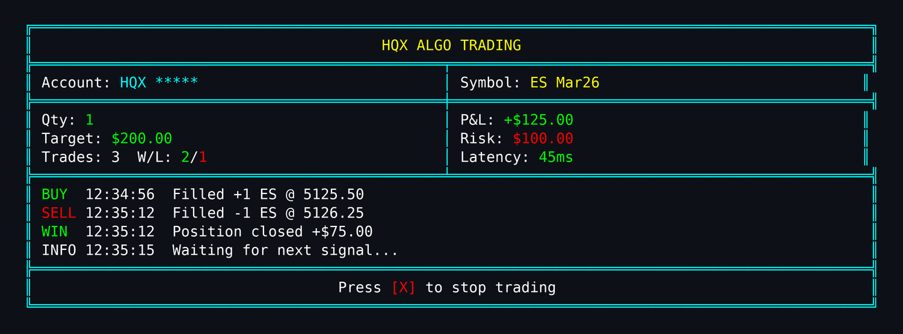
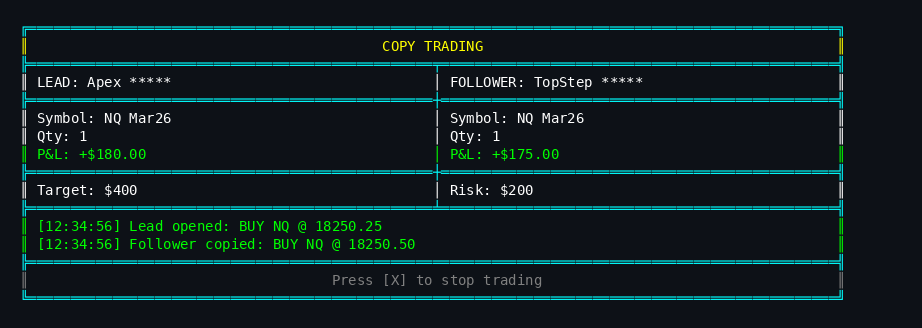

# HedgeQuantX CLI

<div align="center">



### Prop Futures Algo Trading CLI

*Connect to 37+ prop firms and automate your futures trading*

[](https://hedgequantx.com)
[](https://www.npmjs.com/package/hedgequantx)
[](https://www.npmjs.com/package/hedgequantx)
[](https://github.com/HedgeQuantX/HQX-CLI)
[](LICENSE)

[](https://nodejs.org/)
[](https://github.com/HedgeQuantX/HQX-CLI)
[](https://discord.gg/UBKCERctZu)
[](https://github.com/HedgeQuantX/HQX-CLI/pulls)

[](https://hedgequantx.com)
[](https://hedgequantx.com)
[](https://hedgequantx.com)
[](https://hedgequantx.com)

[Website](https://hedgequantx.com) | [Installation](#installation) | [Features](#features) | [Algo Trading](#algo-trading) | [Discord](https://discord.gg/UBKCERctZu)

</div>

---

## Features

| Feature | Description |
|---------|-------------|
| **Multi-Platform** | ProjectX & Rithmic APIs |
| **37+ Prop Firms** | TopStep, Apex, Bulenox, and more |
| **Multi-Account** | Connect multiple accounts simultaneously |
| **Real-Time Stats** | Balance, P&L, positions, orders |
| **Algo Trading** | One Account & Copy Trading modes |
| **Algo Trading** | Proprietary HQX Strategy |
| **Market Hours** | Auto-blocks when market closed |
| **Local Execution** | Direct API trading, no server needed |
| **Secure Storage** | AES-256-GCM encrypted sessions |
| **Auto-Update** | Built-in version checker |

---

## Installation

### NPM (Recommended)

```bash
npm i -g hedgequantx
```

### Update

```bash
npm update -g hedgequantx
```

### From Source

```bash
git clone https://github.com/HedgeQuantX/HQX-CLI.git
cd HQX-CLI
npm install
npm link
```

---

## Usage

```bash
# Launch CLI
hqx

# Or full command
hedgequantx

# Show version
hqx --version
```

---

## Dashboard Preview

<div align="center">

</div>

---

## Algo Trading

### One Account Mode

Trade on a single account with HQX algo strategy.

<div align="center">

</div>

### Copy Trading Mode

Mirror trades from Lead to Follower accounts.

<div align="center">

</div>

---

## Supported Prop Firms

| ProjectX (19) | Rithmic (16) | Tradovate (3) |
|---------------|--------------|---------------|
| TopStep | Apex Trader Funding | Apex |
| TickTickTrader | TopstepTrader | TakeProfitTrader |
| TradeDay | MES Capital | MyFundedFutures |
| Goat Futures | Bulenox | |
| Alpha Futures | TradeFundrr | |
| Bulenox | TheTradingPit | |
| Blusky | FundedFuturesNetwork | |
| The Futures Desk | PropShopTrader | |
| DayTraders | 4PropTrader | |
| E8 Futures | DayTraders.com | |
| Blue Guardian Futures | 10XFutures | |
| FuturesElite | LucidTrading | |
| FXIFY | ThriveTrading | |
| Hola Prime | LegendsTrading | |
| Top One Futures | Earn2Trade | |
| Funding Futures | Tradesea | |
| TX3 Funding | | |
| Lucid Trading | | |
| Tradeify | | |

---

## Security

| Feature | Implementation |
|---------|---------------|
| Encryption | AES-256-GCM |
| Key Binding | Machine-bound keys |
| Input | Validated & sanitized |
| Rate Limiting | API protection |
| File Permissions | 0600 (owner only) |
| Credentials | Never stored in plain text |

---

## Changelog

<details>
<summary><b>v1.8.x (Current)</b></summary>

- Separate UI for One Account and Copy Trading
- Market hours validation
- Arrow keys navigation
- Contracts from API
- Native readline input
- Seamless UI design
- 40 visible activity logs

</details>

<details>
<summary><b>v1.7.x</b></summary>

- HQX algo strategy
- Copy Trading single symbol
- Spinner indicators
- Cyan color theme

</details>

<details>
<summary><b>v1.3.x</b></summary>

- Major refactoring
- Robust update function
- Modular services

</details>

---

## Roadmap

| Done | Done | Coming Soon |
|------|------|-------------|
| :white_check_mark: ProjectX integration | :white_check_mark: One Account mode | :hourglass: Real-time streaming |
| :white_check_mark: Rithmic integration | :white_check_mark: Copy Trading mode | :hourglass: Advanced orders |
| :white_check_mark: 38+ prop firms | :white_check_mark: HQX Server | :hourglass: Mobile app |
| :white_check_mark: Multi-account | :white_check_mark: Market hours check | :hourglass: Telegram alerts |
| :white_check_mark: Stats & equity curve | :white_check_mark: Session summary | :hourglass: Custom strategies |
| :white_check_mark: Encrypted sessions | :white_check_mark: Auto-update | :hourglass: Web dashboard |

---

## Support

<div align="center">

[](https://discord.gg/UBKCERctZu)
[](https://github.com/HedgeQuantX/HQX-CLI/issues)

</div>

---

## License

MIT License - Open Source

---

## Disclaimer

> This software is for educational and informational purposes only. Trading futures involves substantial risk of loss and is not suitable for all investors. Past performance is not indicative of future results.

---

<div align="center">

**Made with passion by HedgeQuantX**

[](https://github.com/HedgeQuantX)

</div>
